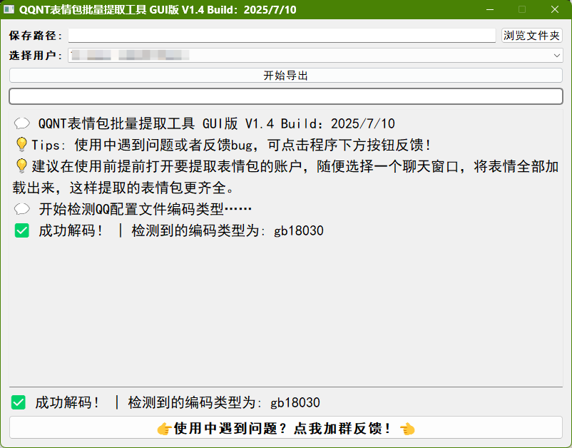

# QQNT表情包批量提取工具  

本仓库Gitee镜像：[点击前往Gitee仓库](https://gitee.com/NyaOH/QQFavoriteExtract)  

使用**Python**编写的QQ表情包批量提取工具  

可**批量**提取QQ账号收藏表情包  

13: 该仓库为**Windows**版，**Android**版请前往[这个仓库](https://github.com/VanillaNahida/QQFavoriteExtract-android)

# 程序界面

# 特点  

 - 全自动操作，自动查找表情文件位置，复制文件并重命名  
 - 支持多账号分开提取对应的收藏表情包
 - 图形化界面，操作更友好

# 使用方法  

22: 1. 请前往[GitHub Release](https://github.com/VanillaNahida/QQFavoriteExtract/releases)下载exe文件
  > [!NOTE]
  > 如果你的网络环境较差，无法连接到 Github，可以使用 [GitHub Proxy](https://mirror.ghproxy.com/) 提供的文件代理加速下载服务
  > 或者您可以前往 [Gitee Release](https://gitee.com/NyaOH/QQFavoriteExtract/releases) 下载exe文件（推荐）

2. 下载好后，推荐先打开要提取表情包的QQ账号，随便打开一个聊天页面，刷新表情

  > [!WARNING]
  >
  > 请务必将你的收藏表情包界面**翻到底**，而不是**只打开页面！**必须让所有表情包图片**完全加载**出来再使用本程序，否则程序提取出来的表情包将会是**不完整**的。
  
  
  
   > [!NOTE]
   > 经过作者测试，QQ在删除收藏表情包后**并不会**将已缓存到本地的表情包一并删除，
   > 所以程序**可能**会提取到账号收藏夹里并不存在的表情包，这是正常的。
   > 后续可能会在程序里添加**一键清除表情包**的功能来避免提取到无关的表情包。

3. 双击运行程序，按照提示选择对应账号和保存位置即可

## 反馈BUG
 - Issue （程序逻辑问题可在此反馈）
 - QQ群 （功能疑问可在此提问）
    - [653040015](https://qm.qq.com/q/yLr5k74qr0)
    - [621457510](https://qm.qq.com/q/8fhlPfJ6Hm)
